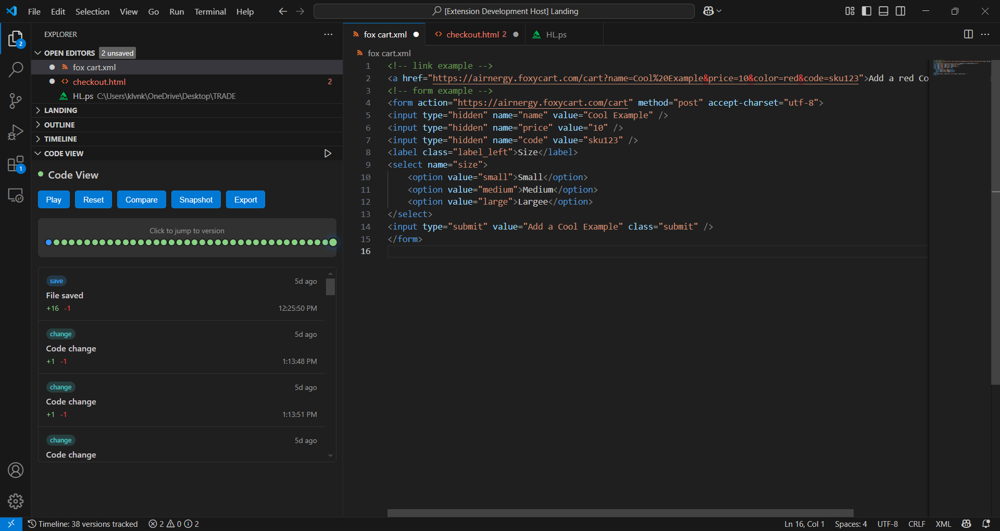
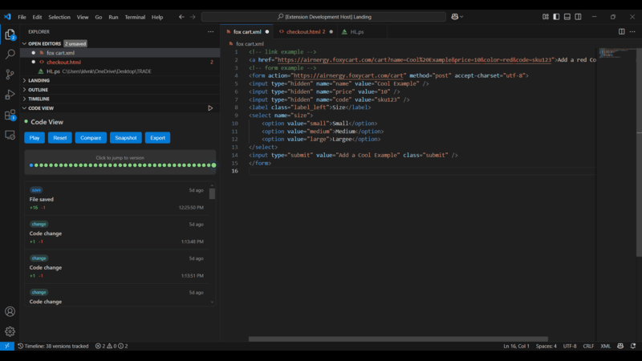
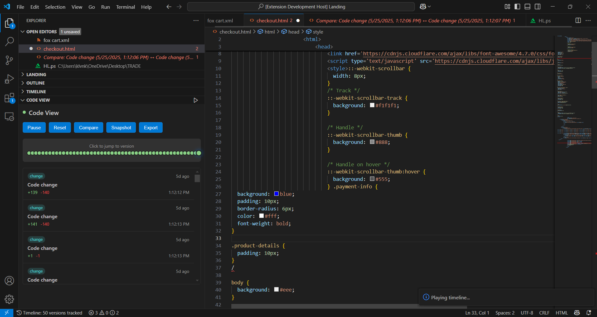
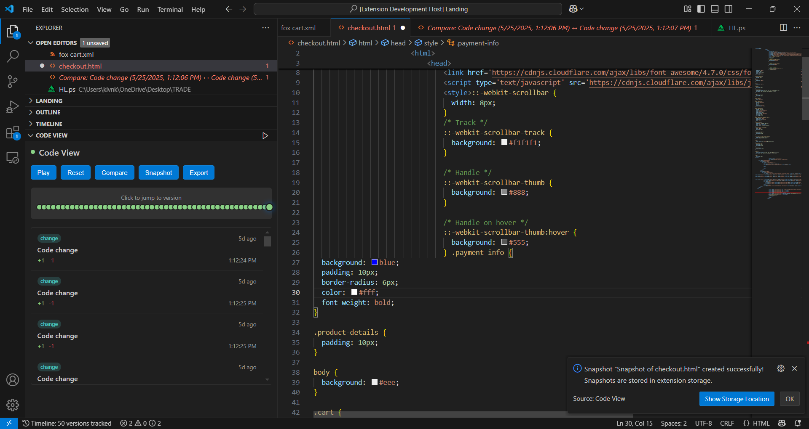

# Code View
Track, visualize, and navigate your code changes with an intuitive timeline interface. Never lose track of your development progress again.

## Features
- 🕒 Interactive timeline of code changes
- 🔄 One-click version restoration
- ⚡ Smart diff comparison
- 📸 Manual snapshot creation
- 🔍 Side-by-side version comparison

## Installation
1. Open VS Code extensions panel
2. Search for "Code View"
3. Click Install

## Usage
1. Open any file
2. Click the timeline icon in the bottom left bar
3. Use controls to navigate through versions

## Screenshots

## Demo Video

